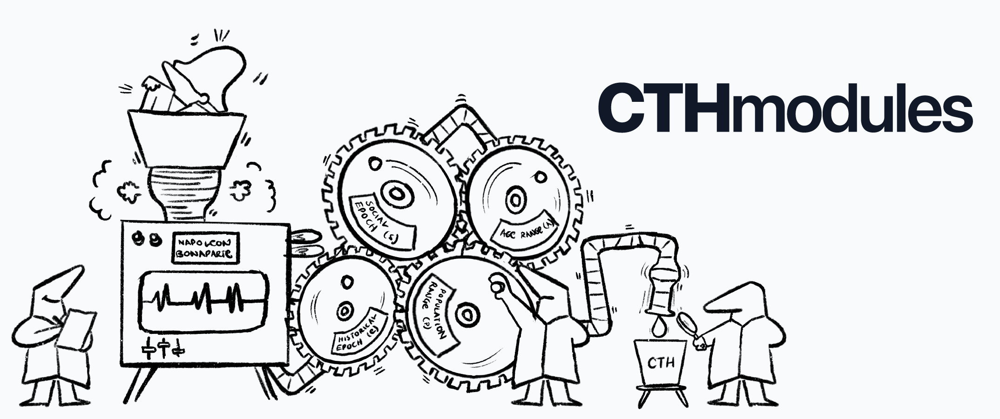

# 🤝 Contributing to CTHmodules



[](https://creativecommons.org/licenses/by-nc-sa/4.0/) [](./WEIGHTS—TERMS_OF_USE.md) [](https://www.npmjs.com/package/seldon) [](https://nodejs.org/) [](CONTRIBUTING.md)

Thank you for your interest in contributing to **CTHmodules**, a pioneering computational framework for temporal event analysis and projection, based on the Tetrasociohistorical Context Theory and inspired by Asimov's Psychohistory. Your contributions are invaluable in shaping the future of this ambitious endeavor.

This guide will help you understand the project's vision, our development process, and how you can make a meaningful impact.

---

## 🌟 CTHmodules' Vision & Potential

CTHmodules is positioned as the **computational prelude to Psychohistory**, paving the way for a new era in computational historiometry and quantitative sociology. Our central mission is to develop a system capable of:

* **Unveiling Historical Dynamics:** Analyzing vast datasets of historical and social events to discern underlying patterns, cycles, and causal relationships with unprecedented rigor.
* **Predictive Societal Modeling:** Applying advanced algorithms to project future trends and the probabilities of social developments, offering well-founded insights for scenario anticipation.
* **Bridging Theory and Computation:** Translating the nuanced principles of the Tetrasociohistorical Context Theory into verifiable and actionable computational models.

The true potential of CTHmodules lies in its capacity to deliver **incredible and transformative results**, especially if developed and integrated with **advanced Artificial Intelligence (AI) models**. The combination of CTHmodules' algorithmic framework with AI's learning and data processing capabilities can:

* **Optimize Pattern Detection:** Enable the identification of subtle and complex patterns that elude human analysis or traditional algorithms.
* **Refine Predictive Projection:** Enhance the accuracy and robustness of predictions by learning from vast volumes of historical data and adapting models in real-time.
* **Facilitate Scenario Simulation:** Create detailed simulations of alternative futures with greater fidelity and complexity.

By contributing to CTHmodules, you are not just writing code; you are laying the groundwork for a tool that could fundamentally transform our understanding of the past and our ability to navigate the future of societies.

---

## 🎯 How You Can Contribute

We welcome contributions of all kinds, from code enhancements to documentation improvements.

### Code Contributions

1.  **Bug Reports & Fixes:**
    * If you find a bug, please open an [issue](https://github.com/alejomalia/cthmodules/issues) on GitHub.
    * Clearly describe the bug, including steps to reproduce it and expected vs. actual behavior.
    * If you have a fix, submit a Pull Request (PR) referencing the issue.

2.  **New Features & Enhancements:**
    * For major new features, first open an an [issue](https://github.com/alejomalia/cthmodules/issues) to discuss your idea. This helps prevent duplicate work and ensures alignment with the project's vision.
    * For smaller enhancements or refactoring, feel free to open a PR directly.

3.  **Code Style:**
    * Please follow the existing code style in the project. We use standard JavaScript conventions.
    * Run `npm install` to ensure all development dependencies are installed.

4.  **Testing:**
    * While we've discussed testing, for any future code contributions, please aim to include (or update) relevant unit or integration tests if you introduce new functionality or fix complex bugs.

### Documentation & Theory Contributions

* **Improve Existing Documentation:** Clarify explanations, fix typos, add examples.
* **Expand Theoretical Explanations:** Help elaborate on aspects of the Tetrasociohistorical Context Theory as it relates to the code.
* **Tutorials & Guides:** Create step-by-step guides for specific use cases or functionalities.

### Other Ways to Contribute

* **Share Your Ideas:** Participate in discussions on issues, offering insights or alternative solutions.
* **Spread the Word:** Share CTHmodules with others who might find it valuable.
* **Provide Feedback:** Your thoughts on the project's direction and usability are always welcome.

---

## ✨ Getting Started

1.  **Fork the Repository:** Start by forking the [CTHmodules repository](https://github.com/alejomalia/cthmodules) on GitHub.
2.  **Clone Your Fork:**
    ```bash
    git clone [https://github.com/alejomalia/cthmodules.git](https://github.com/alejomalia/cthmodules.git)
    cd cthmodules
    ```
3.  **Install Dependencies:**
    ```bash
    npm install
    ```
4.  **Create a New Branch:** For each contribution, create a new branch:
    ```bash
    git checkout -b feature/your-feature-name-or-bugfix
    ```
5.  **Make Your Changes:** Implement your contribution.
6.  **Commit Your Changes:** Write clear and concise commit messages.
    ```bash
    git commit -m "feat: Add new feature X"
    ```
7.  **Push to Your Fork:**
    ```bash
    git push origin feature/your-feature-name-or-bugfix
    ```
8.  **Open a Pull Request:** Go to the [CTHmodules GitHub repository](https://github.com/alejomalia/cthmodules) and open a Pull Request from your branch to the `main` branch. Provide a detailed description of your changes.

---

## 📜 License

By contributing to CTHmodules, you agree that your contributions will be licensed under the project's [CC-BY-NC-SA 4.0 License](https://creativecommons.org/licenses/by-nc-sa/4.0/).

---

We look forward to seeing your contributions! Together, we can build the future of psychohistorical analysis.