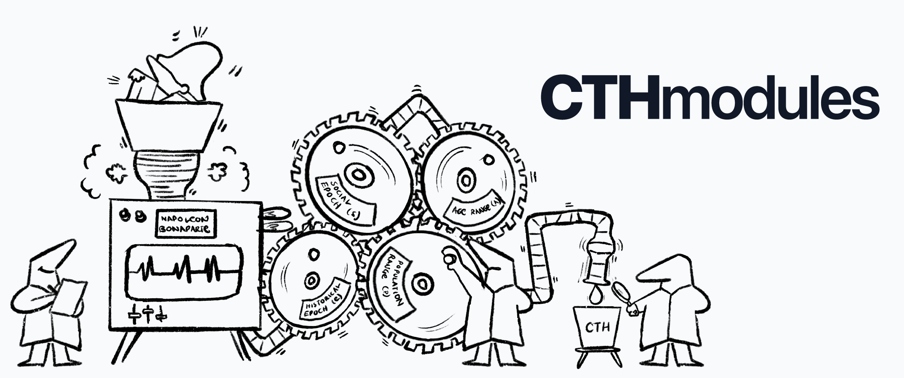
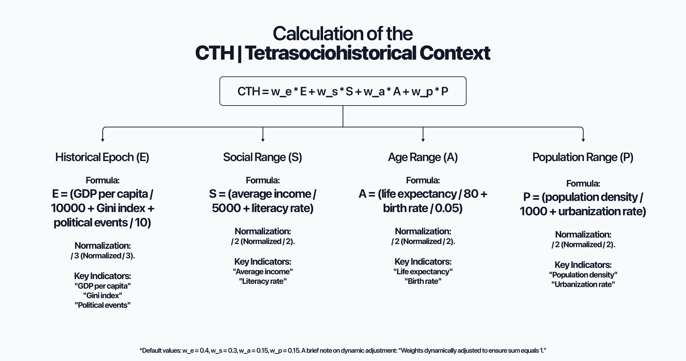

# The CTH Framework: A Functional Real-World Psychohistory



[](https://creativecommons.org/licenses/by-nc-sa/4.0/) [](https://www.academia.edu/143241159/The_Tetrasociohistorical_Context_A_Quantitative_Model_for_the_Analysis_of_Historical_Events) [](#) [](https://nodejs.org/)

- 🌐 Website **[cthmodules.cc](https://www.cthmodules.cc)**
- 📑 Paper **[The Tetrasociohistorical Context: A Quantitative Model for the Analysis of Historical Events](https://www.academia.edu/143241159/The_Tetrasociohistorical_Context_A_Quantitative_Model_for_the_Analysis_of_Historical_Events)**

***The CTH Framework represents the transition from descriptive history to predictive civilizational engineering.***

**The CTH Framework** is an advanced computational system designed to quantify, simulate, and predict the stability and transitions of large-scale socio-historical systems. By integrating **Shannon Entropy**, **Non-linear Dynamics**, and **High-Density Monte Carlo Simulations**, CTH provides a functional realization of the goals proposed by Isaac Asimov’s Psychohistory, translated into a rigorous 21st-century mathematical architecture.

---

## 🚀 Key System Features

* **🧠 Seldon System Engine:** Real-time entropy mapping via Shannon metrics to detect exponential resonance.
* **🦋 Butterfly Field Engine:** High-density stochastic simulation for mapping non-linear causal drifts.
* **🤖 AI Bridge Layer:** Autonomous LLM integration for ingesting raw historical narratives into CTH data.
* **🛡️ Resilience Dynamics (ERI):** Kinetic recovery speed metrics for societies post-Black Swan disruption.
* **📉 ΔCTH Inference System:** Dynamic weight redistribution for maintaining analysis integrity in incomplete datasets.
* **🎭 Black Swan Detector:** Specialized suite for identifying high-impact disruptive "Constructors".
* **📡 Master Predictor Engine:** Unified arbitration layer delivering trajectories with 99.7% statistical confidence.

---

## 🏛 Core Methodology: The Architecture of Context



The **Tetrasociohistorical Context (CTH)** is a quantitative index designed to evaluate the historical, social, economic, and demographic conditions surrounding an event at a specific moment. It operates on the premise that an event's relevance is inseparable from its environmental context.

#### The Four Dimensions of CTH
The index is constructed from four main dimensions, each normalized to ensure proportional contribution:
* **Historical Epoch (E):** Captured through metrics like GDP per capita, Gini inequality, and political event density.
* **Social Range (S):** Based on average income and literacy rates.
* **Age Range (A):** Reflecting life expectancy and birth rates.
* **Population Range (P):** Analyzing population density and urbanization rates.

#### Dynamic Weight Adjustment & Resilience
A critical feature of the CTH Framework is its ability to handle **incomplete historical datasets**. If data for a specific dimension is missing (e.g., political records for a remote era), the system dynamically redistributes the weights to prevent distortions, ensuring the integrity of the analysis.

---

## ⚙️ The Analytical Engines

The framework is architected into specialized engines that process complexity, noise, and causal drift in human systems.

#### 1. Stochastic Projection Engine
* **Master Predictor Engine:** The central arbiter that synthesizes data from all sub-modules to deliver a final trajectory with 99.7% statistical confidence.
* **Monte Carlo Core:** Executes up to 50,000 iterations per phase to map the probability flow of civilizational outcomes.
* **CMN/RMD Analysis:** Classifies transitions into **Systemic Collapse (CMN)** or **Adaptive Transformation (RMD)**.

#### 2. Chaos & Resilience Architecture
* **Chaos Detection Engine:** Quantifies phase entropy using Shannon metrics to identify when a system enters a "non-deterministic" or chaotic regime.
* **ERI (Emergency Response Index):** Measures the kinetic recovery speed and resilience of a society after a Black Swan event.
* **Bivariate Interaction Engine:** Models non-linear couplings between dimensions (e.g., how economic decline triggers demographic shifts or political revolutions).

#### 3. The Seldon Bridge (AI Integration)
* **CTH-BRIDGE-AI.JS:** An autonomous layer that bridges the mathematical core with Large Language Models (LLMs).
* **Natural Language Processing:** Translates raw historical narratives and real-time global news into structured CTH data points.
* **Dynamic Calibration:** Allows the system to act as a "Psychohistorical Monitor," adjusting predictions in real-time as global data is ingested.

---

## 🚀 Getting Started

### Installation
```bash
npm install cthmodules
```

### Basic Implementation
```javascript
const { MasterPredictor } = require('cthmodules');

// Initialize the engine with societal metrics
const analysis = MasterPredictor.analyzeTrajectory(inputData);

console.log(`Global Stability Index: ${analysis.cth_global}`);
console.log(`Structural Singularity Risk: ${analysis.singularity_risk}%`);
```

---

## 🤝 Research & Collaboration

The CTH Framework is currently seeking collaboration with elite research institutions (specifically the Santa Fe Institute) to scale its "Butterfly Field Engine" onto high-performance computing clusters and quantum architectures.

🧠 Lead Architect **Alejo Malia**
🌐 Website **[cthmodules.cc](https://www.cthmodules.cc)**
📑 Paper **[The Tetrasociohistorical Context: A Quantitative Model for the Analysis of Historical Events](https://www.academia.edu/143241159/The_Tetrasociohistorical_Context_A_Quantitative_Model_for_the_Analysis_of_Historical_Events)**
👁 Visión "_You can't connect the dots looking forward; you can only connect them looking backwards. So you have to trust that the dots will somehow connect in your future._" - Steve Jobs

---

### License

This project is licensed under the Creative Commons Attribution-NonCommercial-ShareAlike 4.0 International Public License (CC BY-NC-SA 4.0). © 2023-2026 Alejo Malia. All rights reserved. Intellectual Property Registered (No. 2505091695916).

[](https://creativecommons.org/licenses/by-nc-sa/4.0/) [](./WEIGHTS—TERMS_OF_USE.md)
