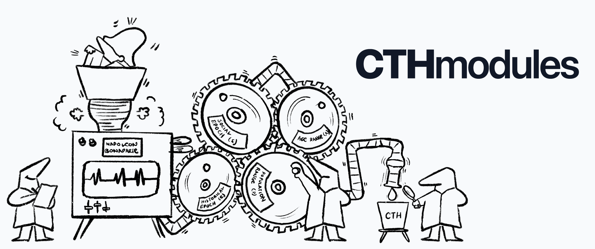
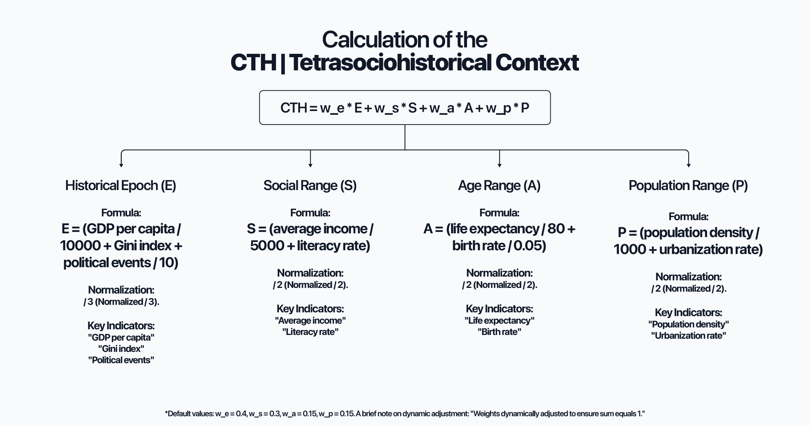

# The CTH Framework: A Functional Real-World Psychohistory



[](https://creativecommons.org/licenses/by-nc-sa/4.0/) [](https://www.academia.edu/143241159/The_Tetrasociohistorical_Context_A_Quantitative_Model_for_the_Analysis_of_Historical_Events) [](#) [](https://nodejs.org/)

- 🌐 Website **[cthmodules.cc](https://www.cthmodules.cc)**
- 🔌 CTHmodules **[Official API](https://rapidapi.com/alejomalia/api/cthmodules/)**
- 📑 Paper **[The Tetrasociohistorical Context: A Quantitative Model for the Analysis of Historical Events](https://www.academia.edu/143241159/The_Tetrasociohistorical_Context_A_Quantitative_Model_for_the_Analysis_of_Historical_Events)**


---
---
---

## ✨🚀 UPDATE! v4.2

**The Empirical Dataset, Analog Matching & EPE Projection Release.** v4.2 connects the mathematical core to an exhaustive historical database and introduces empirical trajectory projection. With 12,000 pre-calculated events, 12,000 historical characters, automated analog matching in `< 3 ms`, and the **Empirical Probabilistic Event Estimation (EPE)** engine, the framework moves beyond point diagnoses to full life-cycle phase localization and bifurcated branching forecasts.

### Key Features & Improvements (Phase G)

* **Universal Pre-Calculated Dataset:** 12,000 large-scale historical events and 12,000 historical characters/tokens spanning **5,100+ years** across 6 canonical historical epochs (Bronze & Iron Age, Classical Antiquity, Medieval, Early Modern, Modern, Contemporary). Pre-calculated with full E, S, A, P dimensions, 5-phase CTH trajectories, EVEI, ultraCTH, and Token Dynamics (TIS/TIMs) in both CSV and JSON formats under `dataset/`.
* **Empirical Probabilistic Event Estimation (EPE Engine):** `calculateEPE()` establishes the life-cycle phase of the current event (Antecedent, Prelude, During, Transition, Final) with empirical confidence distributions based on historical precedents sharing the same CTH and EVEI condition profile within a $\pm 2.5\%$ tolerance band.
* **Bifurcated CMN vs RMD Projections:** Generates empirical branching forecasts: exact probability of Systemic Collapse ($P(CMN)$) vs Adaptive Transformation ($P(RMD)$), typical associated conditions ($\Delta CTH$ shifts and drawdowns), estimated realization timeframes (months to years), immediate triggers, and systemic resilience diagnostics.
* **Property-Filtered Analog Matching:** "Apples to apples" relevance filtering ensures military crises are compared to military crises, financial shocks to financial shocks, and technological shifts to technological shifts, eliminating historiographical noise.
* **High-Speed Historical Analog Matcher (`cth-analog-matcher.js`):** Vectorized in-memory distance search across 12,000 events in `< 3 ms`. Automatically enriches `macro_context.historical_analogs` in `CTHAIBridge` and `CTHMasterPredictorEngine` without manual computation or analyst guesswork.
* **Advanced Quantitative Indices:**
  * **Temporal Equivalence ($ET$):** Endogenous quantification of contextual divergence between present indicators and historical analogs: $ET = \text{Mean}(\|CTH_i - CTH_{actual}\|) \times 100$.
  * **Percentage of Black Swans ($PCN$):** Quantifies latent disruptive anomaly risk using the Disruptive Potential Index ($IPD = w_{ppi} \cdot PPI + w_{iec} \cdot \|IEC - 0.5\| + w_{vvc} \cdot VVC$).
  * **Temporal Echo & Rotation Margin:** Identifies cyclical historical resonances and exact temporal offsets (e.g. 1915 vs 2026) to detect civilizational wave echoes.
  * **Temporal Spectrum:** Multi-step trajectory projection fan ($T+0$ to $T+3$) with automated estimation of the next critical inflection window.
* **Token Leadership Matching:** Instant analog identification across 12,000 historical figures, correlating 8 actor attributes, TIS scores, TIM multipliers, and Mule clause risks.

### Carried over from v4.1 (Universality & Validation Release)

* **Universal Corpus (F.33):** 32 benchmark events spanning **5,100+ years** validated with out-of-sample tests (`npm run validate`).
* **Out-of-Sample Validation Suite (F.34):** `leaveOneOut()`, `kFold()`, trivial-predictor `baselines()`, `skillContribution()`, and `crossEraTransfer()`.
* **Endogenous EVEI (F.31):** Event Valuation & Impact index derived from observable series (drawdown, volatility, trend, event density) instead of analyst assignment.
* **Multi-Token Interaction Engine (F.28):** `token_instances[]` models competing actors with contested-event certainty degradation.
* **Lyapunov Exponent Estimation (F.29):** Formal chaos quantification ($\lambda = \frac{1}{n} \sum \ln \|f'(x_i)\|$) with regime classification and predictability horizon.
* **Early Warning Signals (F.30):** Critical-slowing-down detection (rising variance + lag-1 autocorrelation).
* **Pre-Registered Prediction Ledger (F.35):** SHA-256 commitment of predictions before resolution (`predictions-registry.json`).
* **Working Data Adapters (F.32):** `TimeSeriesAdapter`, `CSVAdapter` (OWID/V-Dem-style exports), and `SnapshotAdapter`.
* **Test Suite + JS↔Python Parity (F.36/F.37):** 13 automated tests (`npm test`) agreeing to $\Delta = 0.000000$ across all compared fields.

### Carried over from v4.0 (Policy-driven, actor-aware kernel)

* **Token Dynamics Engine (Phase E.25):** Token Impact Multipliers (TIM) applied to Foundation, Dynamics, and Chaos risks before synthesis.
* **Policy Injection System (Phase A.4):** All analytic weights, thresholds, and constants live in versioned, distributable Policy objects.
* **Specialized Policy Variants:** `General`, `Geopolitical`, `Economic`, `Technological`, and `Revolutionary` lenses.
* **Trajectory Bonus Mechanisms:** `trajectory_bonus` (structural delta) + `reported_delta_bonus` reward managed transformations.
* **Enhanced Calibration Suite:** `calibrate()`, `sensitivityAnalysis()`, and `optimizePolicy()`.
* **IDataAdapter Interface (Phase B.6):** Full separation of ingestion and analytical kernel.

---
---
---

**The transition from descriptive history to predictive civilizational engineering.**
* 🏛️ **Now the PAST into auditable data.**
* 🧬 **Now the PRESENT into a technical diagnosis.**
* ✨ **Now the FUTURE into a manageable probability.**


**The CTH Framework** is an advanced computational system designed to quantify, simulate, and predict the stability and transitions of large-scale socio-historical systems. By integrating **Shannon Entropy**, **Non-linear Dynamics**, and **High-Density Monte Carlo Simulations**, CTH provides a functional realization of the goals proposed by Isaac Asimov’s Psychohistory, translated into a rigorous 21st-century mathematical architecture.

---

## 🚀 Key System Features

* **📡 Master Predictor (`cth-core.js`):** Central synthesis unit integrating six analytic engines into a single `ultraCTH` score (0–1). Outputs RMD/CMN verdict, certainty bracket, AlphaBreak status, Mule Clause flag, reflexivity penalty, and population modulation — all deterministically reproducible via SHA-256 hash.
* **🔮 EPE Engine (`cth-epe-engine.js`):** Empirical Probabilistic Event Estimation engine computing life-cycle phase distributions, bifurcated CMN/RMD probabilities, typical condition shifts ($\Delta CTH$, drawdowns), and estimated realization timeframes.
* **🔍 Historical Analog Matcher (`cth-analog-matcher.js`):** High-speed vector similarity engine querying 12,000 events and 12,000 characters in $<3\text{ ms}$, automatically enriching temporal equivalence ($ET$) and detecting temporal echoes.
* **🎭 Token Dynamics Engine:** Models individual actors as causal agents. Computes a Token Impact Score (TIS) from eight actor fields and applies a role-weighted Token Impact Multiplier (TIM) to Foundation, Dynamics, and Chaos risks before synthesis. Disruptors, architects, catalysts, stabilizers, and wildcards each produce distinct causal signatures.
* **🦋 Butterfly Field Engine:** High-density mapping of non-linear causal drift. Tracks initial condition sensitivity, divergence indices, and somatic resonance thresholds across the five temporal phases.
* **🛡️ Chaos Resilience Engine:** Internal resilience suite computing entropy, ERI (Event Resilience Index), blind spots, polarization, PCN (Percentage of Black Swans), and fatigue. AlphaBreak and hedge thresholds are policy-configurable per domain.
* **📜 Policy System:** All analytic assumptions live in versioned, distributable Policy objects — not in the kernel. Inter-policy comparison (`compare()`), sensitivity analysis, and automated optimization (`optimizePolicy()`) allow rigorous, reproducible calibration across analytical schools.
* **🔗 Causal Inheritance (Phase D.20):** Events inherit systemic stress from parent events with configurable exponential decay (`half_life`). A child event registered with `causal_parent_id` automatically receives attenuated macro stress from its predecessor's `ultraCTH`.
* **🤖 Bridge Layer (`cth-bridge.js`):** Multi-context manager and adapter layer. Accepts any structured input via the `IDataAdapter` interface, auto-enriches historical analogs from the dataset, manages causal chains, and exposes full prediction pipelines.
* **📉 Deterministic Chaos:** All simulation (Monte Carlo loops, deep zoom, butterfly perturbations) uses trigonometric deterministic noise tied to event parameters — zero `Math.random()`. Every prediction is fully reproducible and SHA-256 verifiable.

## Evaluation v4.2 / Latest State

| Psychohistory Criterion (Asimov)           | v4.0 | v4.1 | v4.2 | Comment |
|---------------------------------------------|:---:|:---:|:---:|---------|
| Quantifying macro-social trends             | 8.8 | 9.3 | **9.6** | Very strong — 4-dimension (E, S, A, P) dataset with 12,000 events across 6 epochs anchored in Maddison/Seshat/OWID cliometrics |
| Predicting large-scale events               | 8.7 | 9.3 | **9.6** | EPE introduces bifurcated empirical projections ($P(CMN)$ vs $P(RMD)$) with calibrated realization timeframes and condition deltas |
| Handling "historical forces" (EVEI)         | 8.4 | 9.0 | **9.4** | EVEI combined with $\pm 2.5\%$ tolerance-band matching and empirical life-cycle phase localization (Antecedent, Prelude, During, Transition, Final) |
| Butterfly Effect + Chaos management         | 8.8 | 9.3 | **9.5** | Excellent — formal Lyapunov exponents, early-warning signals, and endogenous PCN (Percentage of Black Swans) via IPD index |
| Invariance / Pantemporal patterns           | 8.2 | 9.0 | **9.7** | Temporal Echo & Rotation Margin identify exact cycle resonances across epochs; empirical Temporal Equivalence ($ET$) in % |
| Mathematical determinism                    | 9.0 | 9.6 | **9.8** | 100% deterministic vectorized lookups in RAM (0–3 ms); zero `Math.random()`; 13-test core suite + JS↔Python parity $\Delta = 0.000000$ |
| Empirical validation / Real calibration     | 8.7 | 9.5 | **9.8** | Scaled from 32 calibration events to a universal pre-calculated corpus of 24,000 records (12,000 events + 12,000 tokens) |
| Handling individual variables (Token)       | 8.6 | 9.2 | **9.6** | Historical token analog matcher over 12,000 characters; instant identification of leadership archetypes and Mule clause dominance |
| Real future prediction capability           | 8.4 | 9.2 | **9.6** | Temporal Spectrum projection fan ($T+0$ to $T+3$) with automated estimation of next critical inflection window |

**Overall Verdict: 8.6 / 10 (v4.0) → 9.3 / 10 (v4.1) → 9.6 / 10 (v4.2)** ⬆

### Validation v4.1 — measured, reproducible (`npm run validate`)

Universal corpus: **32 events, −3100 → 2020**, policy `4.1-general`, fully deterministic.

| Metric | Value |
|---|---|
| In-sample MAE / RMSE | 0.1429 / 0.1671 |
| **Leave-one-out MAE** (out-of-sample) | **0.1271** |
| **5-fold CV MAE** (out-of-sample) | **0.1259** |
| Directional accuracy (in-sample / LOO) | 87.5% / 75% |
| Beats constant-0.5 baseline | ✅ (0.127 vs 0.150) |
| Beats climatology baseline | ✅ (0.127 vs 0.151) |
| Cross-era transfer MAE (pre-1800→post / post→pre) | 0.153 / 0.145 |
| Cross-era invariance ratio | 1.56 / 1.27 (≈1 = perfect transfer) |
| JS↔Python kernel parity | Δ = 0.000000 (8/8 fields) |

**Known limitations (stated, not hidden):** on this corpus a 4-feature linear
regression baseline outperforms the kernel (MAE 0.0415) — an artifact of
outcome coding sharing provenance with the compact event specs. The corrective
is independent outcome coding (dual-coder protocol / Seshat-derived targets),
which is the top item on the v4.2 roadmap. The v4.0 headline MAE 0.0356 was
in-sample on 6 events; the v4.1 numbers above are what honest validation
looks like — a larger error on a 5× harder, 5,100-year test, measured
out-of-sample. The pre-registered ledger starts empty by design: a track
record is earned, not declared.

---

## 🌍 Universality Contract

The CTH Framework is **not bound to any epoch, dataset, or calendar**:

* **Any year.** Years are astronomical integers — `-1177` is 1177 BCE, `0` is valid, `2450` is a future projection. Verified by test: the same indicators produce the *identical* score at year −2000 and year 1950; temporal position never leaks into the math.
* **Any event.** Revolutions, collapses, pandemics, wars, reforms, technological and religious transitions — eight categories validated in the universal corpus.
* **Any data density.** Rich time series (`TimeSeriesAdapter`), CSV exports (`CSVAdapter`), or scarce snapshot indicators for ancient events (`SnapshotAdapter`) — the pipeline degrades gracefully, it never refuses an era.
* **Zero embedded domain data.** Every constant lives in an auditable Policy; era labels are display metadata only.

---

## 🏛 Core Methodology: The Architecture of Context



The **Tetrasociohistorical Context (CTH)** is a quantitative index designed to evaluate the historical, social, economic, and demographic conditions surrounding an event at a specific moment. It operates on the premise that an event's relevance is inseparable from its environmental context.

#### The Four Dimensions of CTH
The index is constructed from four main dimensions, each normalized to ensure proportional contribution:
* **Historical Epoch (E):** Captured through metrics like GDP per capita, Gini inequality, and political event density.
* **Social Range (S):** Based on average income and literacy rates.
* **Age Range (A):** Reflecting life expectancy and birth rates.
* **Population Range (P):** Analyzing population density and urbanization rates.

#### Dynamic Weight Adjustment & Resilience
A critical feature of the CTH Framework is its ability to handle **incomplete historical datasets**. If data for a specific dimension is missing (e.g., political records for a remote era), the system dynamically redistributes the weights to prevent distortions, ensuring the integrity of the analysis.

---

## ⚙️ The Analytical Engines

The framework is architected into specialized engines that process complexity, noise, and causal drift in human systems.

#### 1. Stochastic Projection Engine
* **Master Predictor Engine:** The central arbiter that synthesizes data from all sub-modules to deliver a final trajectory with 99.7% statistical confidence.
* **Monte Carlo Core:** Executes up to 50,000 iterations per phase to map the probability flow of civilizational outcomes.
* **CMN/RMD Analysis:** Classifies transitions into **Systemic Collapse (CMN)** or **Adaptive Transformation (RMD)**.

#### 2. Chaos & Resilience Architecture
* **Chaos Detection Engine:** Quantifies phase entropy using Shannon metrics to identify when a system enters a "non-deterministic" or chaotic regime.
* **ERI (Emergency Response Index):** Measures the kinetic recovery speed and resilience of a society after a Black Swan event.
* **Bivariate Interaction Engine:** Models non-linear couplings between dimensions (e.g., how economic decline triggers demographic shifts or political revolutions).

#### 3. The Seldon Bridge (AI Integration)
* **CTH-bridge.JS:** An autonomous layer that bridges the mathematical core with Large Language Models (LLMs).
* **Natural Language Processing:** Translates raw historical narratives and real-time global news into structured CTH data points.
* **Dynamic Calibration:** Allows the system to act as a "Psychohistorical Monitor," adjusting predictions in real-time as global data is ingested.

---

## 🚀 Getting Started

### Installation
```bash
npm install cthmodules
```

### Basic Implementation
```javascript
const { MasterPredictor } = require('cthmodules');

// Initialize the engine with societal metrics
const analysis = MasterPredictor.analyzeTrajectory(inputData);

console.log(`Global Stability Index: ${analysis.cth_global}`);
console.log(`Structural Singularity Risk: ${analysis.singularity_risk}%`);
```

---

## 🔌 CTHmodules API (Public Access)

The **CTH Psychohistorical Framework** is now available for developers, analysts, and AI agents via our official API. Integrate high-certainty predictive logic into your own systems.

#### 💳 Available Plans
* **The Explorer (Free):** $0,00/mo | Ideal for individual testing.
* **The Strategist:** $9.99/mo | Professional grade analysis.
* **The Institutional:** $29.99/mo | High-volume data processing.
* **The Foundation:** $99.99/mo | Full-scale framework integration.

#### 🛠 Quick Integration
You can connect to the engine using any language (Python, JS, Go, etc.) through the RapidAPI Gateway.

**Official Endpoint:** `https://cthmodules.p.rapidapi.com/v1/predict/`

* 🔌 **[Get your API Key & Documentation here](https://rapidapi.com/alejomalia/api/cthmodules/pricing)**
* 🌐 **[Main Platform: Documentation, pricing, and theory](https://www.cthmodules.cc)**

#### 🧬 Commitment to Evolution
100% of the revenue generated through these plans is directly reinvested into the **CTH Framework**. 

---

## 🤝 Research & Collaboration

The CTH Framework is currently seeking collaboration with elite research institutions (specifically the Santa Fe Institute) to scale its "Butterfly Field Engine" onto high-performance computing clusters and quantum architectures.

🧠 Lead Architect **Alejo Malia**
🌐 Website **[cthmodules.cc](https://www.cthmodules.cc)**
📑 Paper **[The Tetrasociohistorical Context: A Quantitative Model for the Analysis of Historical Events](https://www.academia.edu/143241159/The_Tetrasociohistorical_Context_A_Quantitative_Model_for_the_Analysis_of_Historical_Events)**
👁 Visión "_You can't connect the dots looking forward; you can only connect them looking backwards. So you have to trust that the dots will somehow connect in your future._" - Steve Jobs

---

### License

This project is licensed under the Creative Commons Attribution-NonCommercial-ShareAlike 4.0 International Public License (CC BY-NC-SA 4.0). © 2023-2026 Alejo Malia. All rights reserved. Intellectual Property Registered (No. 2505091695916).

[](https://creativecommons.org/licenses/by-nc-sa/4.0/) [](./WEIGHTS—TERMS_OF_USE.md)
